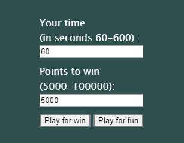
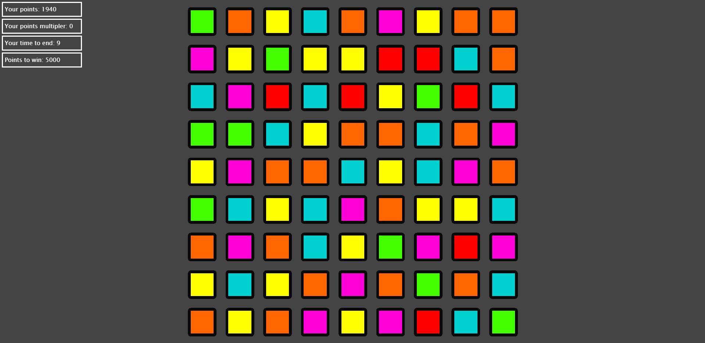

# Threetris 3D

Candy Crush like game created with three.js

## Installation
After app download go into the main directory and launch StartServer.bat

## How to play
At first you choose how long you are going to play and how many points you have to get.

After you got it, the rules are simple - you have to much at least 3 same colour blocks in a row or column :).

